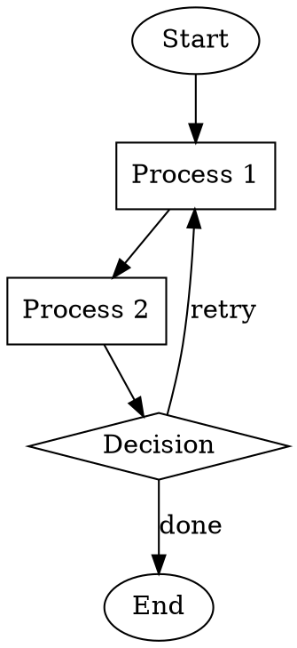
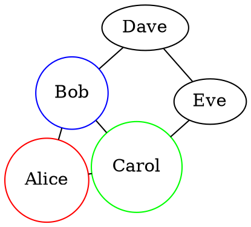
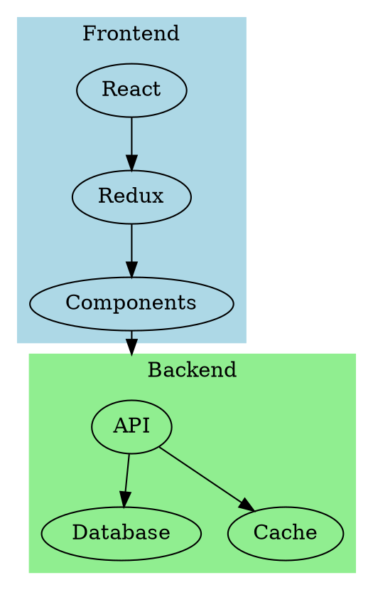
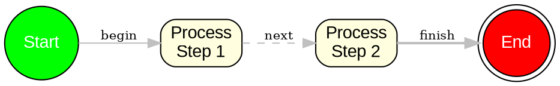

# GraphvizJS Implementation Plan

This document outlines the implementation plan to convert the MermaidJS Desktop Client into a GraphvizJS Desktop Client. Each sprint contains 4-5 atomic tasks that can be implemented independently by a subagent.

## Overview

**Goal**: Convert the MermaidJS diagram editor to support Graphviz DOT format instead of Mermaid syntax.

**Key Changes Required**:
1. Replace `mermaid` npm package with `@hpcc-js/wasm` (Graphviz WebAssembly)
2. Update syntax highlighting for DOT language
3. Modify file dialogs to use `.dot` and `.gv` extensions
4. Replace example diagrams with DOT examples
5. Update all UI text references from "Mermaid" to "Graphviz/DOT"
6. Update help dialog content

---

## Sprint 1: Install Dependencies and Setup Renderer Infrastructure

**Goal**: Get the @hpcc-js/wasm package installed and create the basic Graphviz rendering function.

### Task 1.1: Install @hpcc-js/wasm package
**File**: `package.json` (already done)
**Action**: Run `pnpm install` to install the new dependency
**Command**:
```bash
cd C:/Users/e414639/Github/GraphvizJS && pnpm install
```
**Verification**: Check that `node_modules/@hpcc-js/wasm` exists

### Task 1.2: Create Graphviz renderer utility
**File**: `src/preview/graphviz.ts` (NEW FILE)
**Action**: Create a new file that exports a function to render DOT to SVG using @hpcc-js/wasm
**Content**:
```typescript
import { Graphviz } from '@hpcc-js/wasm/graphviz';

let graphvizInstance: Awaited<ReturnType<typeof Graphviz.load>> | null = null;

export type LayoutEngine = 'dot' | 'neato' | 'fdp' | 'sfdp' | 'circo' | 'twopi' | 'osage' | 'patchwork';

export async function initGraphviz(): Promise<void> {
  if (!graphvizInstance) {
    graphvizInstance = await Graphviz.load();
  }
}

export async function renderDotToSvg(
  dotSource: string,
  engine: LayoutEngine = 'dot'
): Promise<string> {
  if (!graphvizInstance) {
    await initGraphviz();
  }
  return graphvizInstance!.layout(dotSource, 'svg', engine);
}

export function isGraphvizReady(): boolean {
  return graphvizInstance !== null;
}
```
**Verification**: File exists and exports `initGraphviz`, `renderDotToSvg`, `isGraphvizReady`

### Task 1.3: Update Vite config for WASM support (if needed)
**File**: `vite.config.ts`
**Action**: Read the current config and ensure it can handle WASM files. Add `optimizeDeps.exclude` for @hpcc-js/wasm if needed.
**Check**: Read `vite.config.ts` first. If it doesn't have WASM configuration, update it:
```typescript
export default defineConfig({
  // ... existing config
  optimizeDeps: {
    exclude: ['@hpcc-js/wasm'],
  },
});
```
**Verification**: Build succeeds with `pnpm build`

### Task 1.4: Update CSP in tauri.conf.json for WASM
**File**: `src-tauri/tauri.conf.json`
**Action**: Update the Content Security Policy to allow WASM execution
**Change**: In `app.security.csp`, add `'wasm-unsafe-eval'` to script-src:
```json
"csp": "default-src 'self'; script-src 'self' 'wasm-unsafe-eval'; style-src 'self' 'unsafe-inline'; img-src 'self' data:; font-src 'self' data:"
```
**Verification**: App loads without CSP errors in console

---

## Sprint 2: Replace Preview Renderer

**Goal**: Replace the Mermaid rendering logic with Graphviz rendering.

### Task 2.1: Read and understand current render.ts
**File**: `src/preview/render.ts`
**Action**: Read the file to understand the current rendering interface
**Note**: Document the callback structure: `onRenderStart`, `onRenderSuccess`, `onRenderEmpty`, `onRenderError`

### Task 2.2: Replace Mermaid imports with Graphviz
**File**: `src/preview/render.ts`
**Action**:
1. Remove the `mermaid` import at the top
2. Add import for the new Graphviz utility:
```typescript
import { renderDotToSvg, initGraphviz } from './graphviz';
```
**Verification**: No import errors

### Task 2.3: Update the render function for Graphviz
**File**: `src/preview/render.ts`
**Action**: Replace the Mermaid render call with Graphviz. The key change is in the actual rendering:
- Remove: `await mermaid.render('mermaid-preview', source)`
- Replace with: `const svg = await renderDotToSvg(source)`
- Update the SVG insertion logic to use the returned SVG string directly

**Key structure to maintain**:
```typescript
export function createRenderScheduler(/* same params */) {
  // Keep the debounce logic
  // Keep the token-based cancellation
  // Replace mermaid.render() with renderDotToSvg()
  // Keep the callback structure
}
```
**Verification**: Function compiles without type errors

### Task 2.4: Remove Mermaid initialization from main.ts
**File**: `src/main.ts`
**Action**:
1. Find and remove the `mermaid.initialize()` call
2. Add Graphviz initialization at app startup:
```typescript
import { initGraphviz } from './preview/graphviz';

// In the bootstrap function, add:
await initGraphviz();
```
**Verification**: App initializes without errors

### Task 2.5: Update preview container ID handling
**File**: `src/preview/render.ts`
**Action**: Mermaid uses a specific element ID for rendering. Graphviz returns raw SVG. Update the code to:
1. Clear the preview container
2. Insert the SVG string directly using `innerHTML`
```typescript
previewContainer.innerHTML = svg;
```
**Verification**: Preview area shows SVG content

---

## Sprint 3: Update Syntax Highlighting

**Goal**: Replace Mermaid syntax highlighting with DOT syntax highlighting.

### Task 3.1: Read current language.ts to understand structure
**File**: `src/editor/language.ts`
**Action**: Read and document the current StreamLanguage implementation structure
**Note**: Identify the `keywords` array and token matching logic

### Task 3.2: Replace Mermaid keywords with DOT keywords
**File**: `src/editor/language.ts`
**Action**: Replace the `keywords` array with DOT keywords:
```typescript
const keywords = [
  'strict', 'graph', 'digraph', 'subgraph', 'node', 'edge',
];
```

### Task 3.3: Add DOT attribute keywords
**File**: `src/editor/language.ts`
**Action**: Add a new array for DOT attributes and shapes:
```typescript
const attributes = [
  'label', 'shape', 'color', 'style', 'fillcolor', 'fontname', 'fontsize',
  'fontcolor', 'bgcolor', 'rankdir', 'rank', 'weight', 'dir', 'arrowhead',
  'arrowtail', 'headlabel', 'taillabel', 'width', 'height', 'fixedsize',
  'pos', 'xlabel', 'tooltip', 'URL', 'target', 'splines', 'overlap',
  'concentrate', 'compound', 'constraint', 'decorate', 'penwidth',
];

const shapes = [
  'box', 'ellipse', 'circle', 'oval', 'diamond', 'triangle', 'pentagon',
  'hexagon', 'septagon', 'octagon', 'record', 'Mrecord', 'plaintext',
  'point', 'egg', 'doublecircle', 'doubleoctagon', 'tripleoctagon',
  'invtriangle', 'parallelogram', 'trapezium', 'house', 'invhouse',
  'star', 'cylinder', 'note', 'tab', 'folder', 'box3d', 'component',
];
```

### Task 3.4: Update token matching for DOT syntax
**File**: `src/editor/language.ts`
**Action**: Update the `token` function to recognize DOT patterns:
1. Match `->` and `--` as operators (edge arrows)
2. Match `[` and `]` as brackets (attribute delimiters)
3. Match `{` and `}` as braces (subgraph delimiters)
4. Match keywords, attributes, and shapes appropriately
5. Match comments: `//` single-line and `/* */` multi-line
6. Match strings in double quotes
7. Match HTML-like labels: `<...>`

**Example token function structure**:
```typescript
token(stream, state) {
  // Skip whitespace
  if (stream.eatSpace()) return null;

  // Comments
  if (stream.match('//')) { stream.skipToEnd(); return 'comment'; }
  if (stream.match('/*')) { state.inComment = true; }
  if (state.inComment) {
    if (stream.match('*/')) { state.inComment = false; }
    else stream.next();
    return 'comment';
  }

  // Strings
  if (stream.match(/"[^"]*"/)) return 'string';

  // HTML labels
  if (stream.match(/<[^>]*>/)) return 'string';

  // Arrows
  if (stream.match('->') || stream.match('--')) return 'operator';

  // Keywords
  if (stream.match(/\b(strict|graph|digraph|subgraph|node|edge)\b/)) return 'keyword';

  // Attributes
  if (stream.match(/\b(label|shape|color|...)\b/)) return 'attribute';

  // Numbers
  if (stream.match(/\d+(\.\d+)?/)) return 'number';

  // Identifiers
  if (stream.match(/[a-zA-Z_][a-zA-Z0-9_]*/)) return 'variable';

  stream.next();
  return null;
}
```

### Task 3.5: Test syntax highlighting
**Action**: Run `pnpm dev` and verify:
1. `digraph` and `graph` highlight as keywords
2. `->` and `--` highlight as operators
3. Strings in quotes highlight correctly
4. Comments highlight correctly

---

## Sprint 4: Update File Operations

**Goal**: Change file extensions from .mmd/.mermaid to .dot/.gv.

### Task 4.1: Update open-diagram.ts file filters
**File**: `src/toolbar/open-diagram.ts`
**Action**: Find the file dialog options and update extensions:
```typescript
// Change from:
filters: [{ name: 'Mermaid', extensions: ['mmd', 'mermaid', 'md'] }]
// To:
filters: [{ name: 'Graphviz DOT', extensions: ['dot', 'gv'] }]
```
**Verification**: Open dialog shows .dot and .gv files

### Task 4.2: Update save-diagram.ts file filters
**File**: `src/toolbar/save-diagram.ts`
**Action**: Find the save dialog options and update:
```typescript
// Change from:
filters: [{ name: 'Mermaid', extensions: ['mmd'] }]
// To:
filters: [{ name: 'Graphviz DOT', extensions: ['dot'] }]
```
Also update any default filename from `.mmd` to `.dot`
**Verification**: Save dialog defaults to .dot extension

### Task 4.3: Update export-diagram.ts filename handling
**File**: `src/toolbar/export-diagram.ts`
**Action**: Find where export filenames are generated and update:
- Change any `.mmd` references to `.dot`
- Ensure exported PNG/SVG filenames use `.dot` base name
**Verification**: Exported files have correct names

### Task 4.4: Update new-diagram.ts default content
**File**: `src/toolbar/new-diagram.ts`
**Action**: Update the default content for a new diagram:
```typescript
// Change from Mermaid default to DOT default:
const defaultContent = `digraph G {
    A -> B
    B -> C
    C -> A
}`;
```
**Verification**: New diagram shows DOT content

---

## Sprint 5: Create DOT Example Diagrams

**Goal**: Replace Mermaid example diagrams with DOT examples.

### Task 5.1: Delete existing Mermaid examples
**Directory**: `src/examples/`
**Action**: Delete all `.mmd` files:
- `01-flowchart.mmd`
- `02-class.mmd`
- `03-sequence.mmd`
- `04-entity-relationship.mmd`
- `05-state-diagram.mmd`
- `06-gantt.mmd`
- `07-git.mmd`

### Task 5.2: Create basic directed graph example
**File**: `src/examples/01-directed-graph.dot` (NEW FILE)
**Content**:


### Task 5.3: Create undirected graph example
**File**: `src/examples/02-undirected-graph.dot` (NEW FILE)
**Content**:


### Task 5.4: Create cluster/subgraph example
**File**: `src/examples/03-clusters.dot` (NEW FILE)
**Content**:


### Task 5.5: Create styled graph example
**File**: `src/examples/04-styled-graph.dot` (NEW FILE)
**Content**:


---

## Sprint 6: Update Examples Menu and Glob Import

**Goal**: Update the examples menu in HTML and the glob import pattern.

### Task 6.1: Update examples-menu.ts glob pattern
**File**: `src/toolbar/examples-menu.ts`
**Action**: Find the Vite glob import and update the pattern:
```typescript
// Change from:
import.meta.glob('../examples/*.mmd', { eager: true, query: '?raw' })
// To:
import.meta.glob('../examples/*.dot', { eager: true, query: '?raw' })
```
**Verification**: Examples load correctly

### Task 6.2: Update index.html examples menu items
**File**: `src/index.html`
**Action**: Find the `[data-menu="examples"]` section and update menu items:
```html
<div data-menu="examples" class="menu hidden">
    <button data-example="01-directed-graph">Directed Graph</button>
    <button data-example="02-undirected-graph">Undirected Graph</button>
    <button data-example="03-clusters">Clusters</button>
    <button data-example="04-styled-graph">Styled Graph</button>
</div>
```
**Verification**: Examples dropdown shows correct items

### Task 6.3: Update any hardcoded example references
**File**: Multiple files in `src/toolbar/`
**Action**: Search for any hardcoded references to `.mmd` files and update to `.dot`
**Command**: `grep -r "\.mmd" src/`
**Verification**: No `.mmd` references remain in source

### Task 6.4: Test examples loading
**Action**: Run `pnpm dev` and verify:
1. Examples dropdown populates correctly
2. Clicking each example loads the DOT content
3. Preview renders the diagram
**Verification**: All examples work

---

## Sprint 7: Update UI Text and Help Dialog

**Goal**: Replace all Mermaid references in the UI with Graphviz/DOT.

### Task 7.1: Update index.html title and text
**File**: `src/index.html`
**Action**: Search and replace all occurrences of "Mermaid" with "Graphviz" or "DOT":
- Page title
- Any visible labels or tooltips
- Button titles
**Verification**: No "Mermaid" text visible in UI

### Task 7.2: Update help dialog content
**File**: `src/help/dialog.ts`
**Action**: Update the help dialog content:
1. Change app name from "MermaidJS Desktop" to "GraphvizJS Desktop"
2. Update description to mention DOT diagrams
3. Update any keyboard shortcut descriptions
4. Add DOT syntax tips if appropriate
**Verification**: Help dialog shows correct content

### Task 7.3: Update status messages
**File**: `src/main.ts` or wherever status messages are defined
**Action**: Search for any status messages that mention "Mermaid" and update:
- "Invalid Mermaid syntax" → "Invalid DOT syntax"
- "Mermaid diagram saved" → "DOT diagram saved"
- etc.
**Verification**: Status messages reference DOT

### Task 7.4: Update error messages in render.ts
**File**: `src/preview/render.ts`
**Action**: Update error messages to reference DOT syntax:
```typescript
// Change from:
"Invalid Mermaid syntax"
// To:
"Invalid DOT syntax"
```
**Verification**: Error messages are correct

### Task 7.5: Update window title in main.ts
**File**: `src/main.ts`
**Action**: If the window title is set dynamically, update it:
```typescript
// Change from:
document.title = "MermaidJS Desktop - " + filename
// To:
document.title = "GraphvizJS Desktop - " + filename
```
**Verification**: Window title is correct

---

## Sprint 8: Add Layout Engine Selector (Optional Enhancement)

**Goal**: Add a UI control to select Graphviz layout engine.

### Task 8.1: Add layout engine dropdown to toolbar
**File**: `src/index.html`
**Action**: Add a select element to the toolbar:
```html
<select id="layout-engine" title="Layout Engine">
    <option value="dot" selected>dot (hierarchical)</option>
    <option value="neato">neato (spring model)</option>
    <option value="fdp">fdp (force-directed)</option>
    <option value="sfdp">sfdp (scalable fdp)</option>
    <option value="circo">circo (circular)</option>
    <option value="twopi">twopi (radial)</option>
    <option value="osage">osage (array-based)</option>
    <option value="patchwork">patchwork (squarified)</option>
</select>
```

### Task 8.2: Create layout engine handler
**File**: `src/toolbar/layout-engine.ts` (NEW FILE)
**Action**: Create a handler for the layout engine selector:
```typescript
import type { LayoutEngine } from '../preview/graphviz';

export function setupLayoutEngine(
  onEngineChange: (engine: LayoutEngine) => void
) {
  const select = document.querySelector<HTMLSelectElement>('#layout-engine');
  if (!select) return;

  select.addEventListener('change', () => {
    onEngineChange(select.value as LayoutEngine);
  });
}

export function getCurrentEngine(): LayoutEngine {
  const select = document.querySelector<HTMLSelectElement>('#layout-engine');
  return (select?.value || 'dot') as LayoutEngine;
}
```

### Task 8.3: Integrate layout engine with renderer
**File**: `src/preview/render.ts`
**Action**: Update the render function to accept and use the layout engine:
```typescript
import { getCurrentEngine } from '../toolbar/layout-engine';

// In render function:
const svg = await renderDotToSvg(source, getCurrentEngine());
```

### Task 8.4: Wire up layout engine in main.ts
**File**: `src/main.ts`
**Action**: Initialize the layout engine handler and trigger re-render on change:
```typescript
import { setupLayoutEngine } from './toolbar/layout-engine';

setupLayoutEngine(() => {
  // Trigger re-render with new engine
  scheduleRender();
});
```

### Task 8.5: Style the layout dropdown
**File**: `src/styles.css`
**Action**: Add styling for the layout engine dropdown to match the toolbar:
```css
#layout-engine {
  height: 28px;
  padding: 0 8px;
  border: 1px solid var(--border-color);
  border-radius: 4px;
  background: var(--bg-color);
  font-size: 12px;
}
```

---

## Sprint 9: Testing and Bug Fixes

**Goal**: Comprehensive testing and fixing any issues.

### Task 9.1: Test basic rendering
**Action**:
1. Run `pnpm dev`
2. Type a simple DOT graph
3. Verify preview updates
**Test cases**:
- `digraph { A -> B }` should render
- `graph { A -- B }` should render
- Invalid syntax should show error

### Task 9.2: Test file operations
**Action**: Test each file operation:
1. New diagram (Ctrl+N)
2. Open diagram (Ctrl+O) with .dot file
3. Save diagram (Ctrl+S) as .dot
4. Export as PNG (1x and 2x)
5. Export as SVG
**Verification**: All operations work correctly

### Task 9.3: Test all examples
**Action**: Click each example in the dropdown and verify:
1. Example content loads
2. Preview renders correctly
3. No console errors

### Task 9.4: Test edge cases
**Action**: Test edge cases:
1. Empty document
2. Very large graph
3. Graph with special characters in labels
4. Graph with HTML labels
5. Graph with multiple subgraphs

### Task 9.5: Run linter and fix issues
**Action**:
```bash
pnpm lint:fix
```
Fix any remaining linting issues.

---

## Sprint 10: Production Build and Verification

**Goal**: Create production build and verify the application.

### Task 10.1: Clean build artifacts
**Command**:
```bash
cd C:/Users/e414639/Github/GraphvizJS && pnpm clean
```

### Task 10.2: Run production build
**Command**:
```bash
cd C:/Users/e414639/Github/GraphvizJS && pnpm tauri build
```
**Verification**: Build completes without errors

### Task 10.3: Test the built application
**Action**:
1. Run the built .exe from `src-tauri/target/release/`
2. Test all features work in production build
3. Verify WASM loads correctly

### Task 10.4: Verify window close fix is preserved
**Action**: Click X to close the app and verify the process terminates (the fix we added earlier)

### Task 10.5: Create initial git commit
**Command**:
```bash
cd C:/Users/e414639/Github/GraphvizJS
git add .
git commit -m "Initial GraphvizJS implementation

Convert MermaidJS Desktop to GraphvizJS Desktop:
- Replace mermaid with @hpcc-js/wasm for rendering
- Update syntax highlighting for DOT language
- Add DOT example diagrams
- Update file dialogs for .dot/.gv extensions
- Update all UI text references
- Add layout engine selector

Based on MermaidJS Desktop Client by Martín M.

Co-Authored-By: Claude <noreply@anthropic.com>"
```

---

## File Change Summary

| Sprint | Files Modified | Files Created | Files Deleted |
|--------|----------------|---------------|---------------|
| 1 | vite.config.ts, tauri.conf.json | src/preview/graphviz.ts | - |
| 2 | src/preview/render.ts, src/main.ts | - | - |
| 3 | src/editor/language.ts | - | - |
| 4 | src/toolbar/open-diagram.ts, save-diagram.ts, export-diagram.ts, new-diagram.ts | - | - |
| 5 | - | 4 .dot files | 7 .mmd files |
| 6 | src/toolbar/examples-menu.ts, src/index.html | - | - |
| 7 | src/index.html, src/help/dialog.ts, src/main.ts, src/preview/render.ts | - | - |
| 8 | src/index.html, src/main.ts, src/preview/render.ts, src/styles.css | src/toolbar/layout-engine.ts | - |
| 9-10 | Various fixes | - | - |

---

## Estimated Time Per Sprint

| Sprint | Description | Est. Time |
|--------|-------------|-----------|
| 1 | Dependencies & Infrastructure | 10 min |
| 2 | Replace Preview Renderer | 15 min |
| 3 | Syntax Highlighting | 15 min |
| 4 | File Operations | 10 min |
| 5 | Example Diagrams | 10 min |
| 6 | Examples Menu | 5 min |
| 7 | UI Text Updates | 10 min |
| 8 | Layout Engine (optional) | 15 min |
| 9 | Testing | 15 min |
| 10 | Production Build | 10 min |
| **Total** | | **~2 hours** |

---

## Notes for Subagents

1. **Always read the target file first** before making changes
2. **Preserve existing code structure** - only change what's necessary
3. **Test after each task** when possible
4. **Don't change unrelated code** - stay focused on the task
5. **Use exact string matching** for edits - include enough context
6. **Report any blockers** immediately if something unexpected occurs
