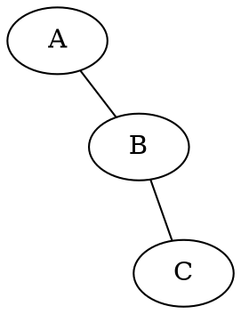

# GraphvizJS Desktop Roadmap

## Completed (Phase 1)

- [x] Graphviz WASM rendering engine integration
- [x] DOT syntax highlighting with CodeMirror
- [x] File operations (.dot/.gv support)
- [x] SVG/PNG export functionality
- [x] Built-in DOT example diagrams
- [x] Help dialog with keyboard shortcuts
- [x] Window state persistence

## Completed (Phase 3)

### Layout Engine Selector (Sprint 1)

**Priority:** Medium
**Effort:** ~30 minutes
**Status:** Completed (2026-01-20)

Add a toolbar dropdown to switch between Graphviz layout engines without editing DOT source.

**Layout Engines:**
| Engine | Best For |
|--------|----------|
| dot | Hierarchical/directed graphs (default) |
| neato | Spring model for undirected graphs |
| fdp | Force-directed placement |
| sfdp | Scalable force-directed (large graphs) |
| circo | Circular layout |
| twopi | Radial layout |
| osage | Array-based layout |
| patchwork | Squarified treemap |

**Implementation:**
1. Add `<select>` dropdown to toolbar in `index.html`
2. Create `src/toolbar/layout-engine.ts` handler
3. Update `render.ts` to pass engine to `renderDotToSvg()`
4. Wire up in `main.ts` to trigger re-render on change
5. Style dropdown to match toolbar aesthetic

**Workaround:** Users can add `layout=engine` attribute in DOT source:


**Reference:** See `docs/planning/PHASE_1_SPRINT_8_TODO.json` for detailed implementation steps.

---

## Future Enhancements

### Dark Mode Theme

**Priority:** High
**Effort:** ~45 minutes
**Status:** Planned

Add system-aware dark mode with manual toggle for the entire application.

**Implementation:**
1. Create CSS custom properties for light/dark color schemes in `style.css`
2. Add `src/theme/mode.ts` to detect system preference via `prefers-color-scheme`
3. Create toggle button in toolbar (sun/moon icon)
4. Update CodeMirror theme in `src/editor/theme.ts` with dark variant
5. Persist preference in Tauri store
6. Apply theme class to `<html>` element for CSS cascade

**Files to modify:** `style.css`, `index.html`, `src/editor/theme.ts`, `src/window/state.ts`
**Files to create:** `src/theme/mode.ts`

---

### Recent Files List

**Priority:** High
**Effort:** ~30 minutes
**Status:** Planned

Show recently opened files in a dropdown menu for quick access.

**Implementation:**
1. Store recent file paths (max 10) in Tauri store
2. Create `src/toolbar/recent-files.ts` with menu component
3. Add "Recent Files" submenu to File menu or toolbar dropdown
4. Update `open-diagram.ts` to add opened files to recent list
5. Handle missing files gracefully (remove from list if not found)
6. Add keyboard shortcut (Ctrl+Shift+O) to open recent files menu

**Files to modify:** `index.html`, `src/toolbar/open-diagram.ts`, `src/window/state.ts`
**Files to create:** `src/toolbar/recent-files.ts`

---

### Auto-Save / Recovery

**Priority:** Medium
**Effort:** ~45 minutes
**Status:** Completed (2026-01-27)

Automatically save drafts and recover unsaved work after crashes.

**Implementation:**
1. Create `src/autosave/manager.ts` for periodic draft saving
2. Store drafts in app data directory with timestamps
3. Save draft every 30 seconds if content changed (debounced)
4. On startup, check for recovery files newer than last save
5. Prompt user to recover or discard unsaved drafts
6. Clean up old drafts (older than 7 days)

**Files to create:** `src/autosave/manager.ts`, `src/autosave/recovery.ts`
**Files to modify:** `src/main.ts`, `src/toolbar/save-diagram.ts`

---

### Multiple Tabs/Documents (Sprint 3)

**Priority:** Medium
**Effort:** ~2 hours
**Status:** Completed (2026-01-27)

Support multiple open documents in a tabbed interface.

**Implementation:**
1. Create `src/tabs/manager.ts` for tab state management
2. Add tab bar component above editor in `index.html`
3. Each tab maintains: content, file path, dirty state, scroll position
4. Update toolbar actions to operate on active tab
5. Add keyboard shortcuts: Ctrl+T (new tab), Ctrl+W (close tab), Ctrl+Tab (switch)
6. Sync preview with active tab's content
7. Confirm before closing dirty tabs

**Files to create:** `src/tabs/manager.ts`, `src/tabs/tab-bar.ts`
**Files to modify:** `index.html`, `style.css`, `src/main.ts`, all toolbar actions

**Reference:** See `docs/planning/PHASE_3_SPRINT_3_TODO.json` for detailed implementation steps.

---

### DOT Syntax Validation/Linting (Sprint 4)

**Priority:** Medium
**Effort:** ~1 hour
**Status:** Planned

Real-time DOT syntax validation with inline error markers.

**Implementation:**
1. Install `@codemirror/lint` package
2. Add `validateDot()` function to `src/preview/graphviz.ts` for error-only validation
3. Create `src/editor/linting.ts` using CodeMirror's `linter()` and `lintGutter()`
4. Parse error line/column from Graphviz error messages using regex heuristics
5. Map errors to CodeMirror `Diagnostic` objects with correct positions
6. Wire lint extension into `createTabEditor()` in `main.ts`
7. Style lint gutter markers, squiggles, and tooltips
8. Debounce validation (500ms) independently from preview rendering

**Files to create:** `src/editor/linting.ts`
**Files to modify:** `src/preview/graphviz.ts`, `src/main.ts`, `src/styles.css`

**Reference:** See `docs/planning/PHASE_3_SPRINT_4_TODO.json` for detailed implementation steps.

**Note:** Graphviz error messages vary in format; parsing may need heuristics.

---

### Export to SVG File

**Priority:** Low
**Effort:** ~15 minutes
**Status:** Planned

Save the rendered diagram as a standalone `.svg` file via the native save dialog.

**Implementation:**
1. Add "Save as SVG" option to export menu in `index.html`
2. Use existing `renderDotToSvg()` output
3. Write SVG string to file via Tauri `fs` plugin and `dialog.save()`
4. Default filename from current file path or `diagram.svg`

**Files to modify:** `index.html`, `src/toolbar/export-diagram.ts`, `src/toolbar/export-menu.ts`

---

### Export to PDF

**Priority:** Low
**Effort:** ~30 minutes
**Status:** Planned

Add PDF export option alongside SVG and PNG.

**Implementation:**
1. Add PDF option to export menu in `index.html`
2. Create `src/toolbar/export-pdf.ts` handler
3. Use SVG-to-PDF conversion (jsPDF + svg2pdf.js or similar)
4. Apply same padding/background as PNG export
5. Support page size selection (A4, Letter, fit-to-content)

**Dependencies:** May require additional npm package (jspdf, svg2pdf.js)
**Files to create:** `src/toolbar/export-pdf.ts`
**Files to modify:** `index.html`, `src/toolbar/export-menu.ts`

---

### Graph Statistics Panel

**Priority:** Low
**Effort:** ~45 minutes
**Status:** Planned

Display graph metrics (node count, edge count, etc.) in a collapsible panel.

**Implementation:**
1. Create `src/stats/panel.ts` for statistics calculation and display
2. Parse rendered SVG to count nodes (`<g class="node">`) and edges (`<g class="edge">`)
3. Extract graph attributes from DOT source (directed/undirected, strict, etc.)
4. Display in collapsible panel below preview or in status bar
5. Update stats on each successful render

**Metrics to display:**
- Node count
- Edge count
- Graph type (digraph/graph)
- Subgraph/cluster count
- Layout engine used

**Files to create:** `src/stats/panel.ts`
**Files to modify:** `index.html`, `style.css`, `src/preview/render.ts`

---

### Custom Node/Edge Templates

**Priority:** Low
**Effort:** ~1.5 hours
**Status:** Planned

Provide template snippets for common node and edge styles.

**Implementation:**
1. Create `src/templates/library.ts` with predefined DOT snippets
2. Add "Insert Template" dropdown to toolbar
3. Categories: Nodes (box, circle, record, HTML), Edges (arrow styles, labels), Clusters
4. Insert template at cursor position in editor
5. Support user-defined templates stored in app config
6. Template preview on hover in dropdown

**Files to create:** `src/templates/library.ts`, `src/templates/menu.ts`
**Files to modify:** `index.html`, `src/editor/setup.ts`

**Example templates:**
```dot
// Record node
node [shape=record, label="{Title|field1|field2}"]

// HTML node
node [shape=none, label=<
  <TABLE BORDER="0" CELLBORDER="1" CELLSPACING="0">
    <TR><TD>Header</TD></TR>
    <TR><TD>Content</TD></TR>
  </TABLE>
>]
```
