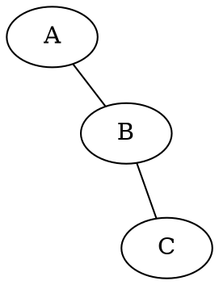

# GraphvizJS Desktop Roadmap

## Completed (Phase 1)

- [x] Graphviz WASM rendering engine integration
- [x] DOT syntax highlighting with CodeMirror
- [x] File operations (.dot/.gv support)
- [x] SVG/PNG export functionality
- [x] Built-in DOT example diagrams
- [x] Help dialog with keyboard shortcuts
- [x] Window state persistence

## Future Features

### Layout Engine Selector (Sprint 8)

**Priority:** Medium
**Effort:** ~15 minutes
**Status:** Planned

Add a toolbar dropdown to switch between Graphviz layout engines without editing DOT source.

**Layout Engines:**
| Engine | Best For |
|--------|----------|
| dot | Hierarchical/directed graphs (default) |
| neato | Spring model for undirected graphs |
| fdp | Force-directed placement |
| sfdp | Scalable force-directed (large graphs) |
| circo | Circular layout |
| twopi | Radial layout |
| osage | Array-based layout |
| patchwork | Squarified treemap |

**Implementation:**
1. Add `<select>` dropdown to toolbar in `index.html`
2. Create `src/toolbar/layout-engine.ts` handler
3. Update `render.ts` to pass engine to `renderDotToSvg()`
4. Wire up in `main.ts` to trigger re-render on change
5. Style dropdown to match toolbar aesthetic

**Workaround:** Users can add `layout=engine` attribute in DOT source:

**Reference:** See `docs/planning/PHASE_1_SPRINT_8_TODO.json` for detailed implementation steps.

---

### Potential Future Enhancements

- [ ] Dark mode theme
- [ ] Recent files list
- [ ] Auto-save / recovery
- [ ] Multiple tabs/documents
- [ ] DOT syntax validation/linting
- [ ] Export to PDF
- [ ] Graph statistics panel
- [ ] Custom node/edge templates
